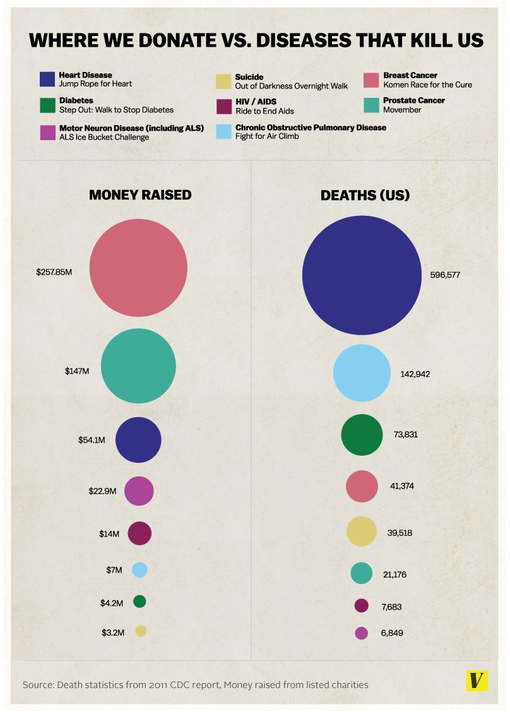

### Obiettivi

1. Analisi di visualizzazione
2. Redesign

### Strumento

RStudio, e le librerie ritenute utili.

---

## Tema d'esame

Si consideri il seguente grafico preso da un [articolo di Vox (del 20 Agosto 2014)](http://www.vox.com/2014/8/20/6040435/als-ice-bucket-challenge-and-why-we-give-to-charity-donate).



L'articolo commenta il disallineamento tra l'attenzione mediatica con i relativi fondi raccolti pubblicamente e le cause di morte reali.

---

Analisi

Analizzare il grafico sopra riportato secondo gli aspetti seguenti:

### Question: c'è una domanda (o più di una) a cui la visualizzazione risponde? Scriverla con parole proprie.
Il grafico in sostanza vuole chiaramente rispondere alla domanda: "Qual è il rapporto che esiste tra la quantità di denaro che si dona per una malattia e gli effettivi morti che quella malattia causa?"


### Data: i dati riportati sono validi e supportano la domanda? La qualità dei dati è appropriata? Indicare le caratteristiche non adeguate.

Caratteristica      | Valutazione dell'adequatezza
-------------------:|-------------------------------------------------
Accuracy            |
Completeness        | 
Consistency         | 
Currency            | 
Credibility         | 
Understandability   | 
Precision           | 

Accuracy: 
Per quanto riguarda l'accuratezza dei dati relativi alle quantità di denaro, qui bisogna fare una open world assumption in quanto ci viene parlato solo delle listed charities e non di tutte le charities del mondo. In tale contesto i dati risultano accurati.

Commenti prof:
Malattie potremmo dire che è un mondo chiuso(esiste elenco di tutte le malattie). Non è ovvio dire quale mettere e quali no (magari raffreddore comune no)
Charities magari non sono tutte.


Per i dati sulle morti invece, questi sono dati che potremmo anche qui considerare in un contesto di open world assumption in quanto sono solo le morti degli Stati Uniti e non relative a tutti i paesi del mondo (dove potrebbero variare).Sempre in questo contesto anche questi dati sono da ritenersi accurati.
Completeness:
E' vero che non abbiamo i dati di tutte le malattie al mondo, però è difficile dire se siano completi o meno. Potrebbero essere anche solo malattie scelte da chi scriveva l'articolo per rafforzare la sua tesi. Non avendo la classifica di tutte le morti, magari potrebbe esserci una malattia con tantissimi morti, ma per la quale si dona tantissimo che però non è riportata.
Consistency:
Non appaiono problemi di consistenza nei dati

Commenti prof:
a rigore il suicidio non è una malattia (dietro potrebbero esserci tante cause)

Currency:
L'articolo risale al 2014, i dati sulle morti sono invece del 2011. Andrebbe meglio se fossero un po' più vicini a livello temporale (es. 2013), ma presumendo che non sia cambiato troppo in 2 anni, sono adatti per lo scopo che ci si propone.
Credibility:
C'è la fonte sui dati, quindi nessun problema di credibilità

Commenti: dati provengono da fonti ufficiali


Understandability:
Viene descritto come i dati sono srati misurati e cosa descrivono, dunque non si riscontrano problemi di comprensibilità.

Il significato dei dati è chiaro

Precision:
Giusto livello di precisione. Non aveva senso scendere più nel dettaglio per quanto riguarda i soldi.


#### Visual Proportionality: le misure sono riportate in maniera uniformemente proporzionale?
C'è un grosso problema di proporzionalità. Il numero è infatti codificato dall'area di un cerchio, ma noi sappiamo che questo comporta un lie factor percettivo maggiore di 1. Questo è spiegato dalla legge di Stevens, la quale afferma che p(x)=c*x^B dove x è il rapporto tra due aree, c una costante e B un fattore che per le 2 dimensioni oscilla tra 0.6 e 0.9. Siamo quindi portati a sottostimare i rapporti tra le aree che vediamo. 


OK ci sono etichette di fianco, ma io voglio il grafico che sia "autosufficiente"


#### Visual Utility: tutti gli elementi presenti nel grafico trasmettono informazioni utili?
La legenda così com'è ora non è molto utile e andrebbe modificata. Approfondito poi nella clarity il perchè.


#### Visual Clarity: i dati del grafico sono chiaramente identificabili e comprensibili (opportunamente descritti)?
Problema nei colori. Sono stati usati i colori per creare una connessione tra il numero di morti e i soldi ricavati, ma non aiuta molto, anzi, risulta abbastanza difficile a primo impatto capire di dover fare un'associazione tra due cerchi di colore uguale (la distanza non aiuta). Anche il fatto che ci siano forse troppi colori non aiuta in quanto noi siamo in grado di distinguerne 4 o 5, dopo inziamo a fare fatica se messi tutti assieme. 
C'è anche troppa distanza tra la legenda e i cerchi. Si potrebbe pensare qui di inserire un direct Labeling perchè l'osservatore fa davvero fatica a capire ogni cerchio a quale malattia corrisponde, dovendo fare un continuo avanti e indietro.


## Design

Riprogettare la visualizzazione in modo da risolvere i problemi evidenziati nell'analisi.

```{r import delle librerie,include=FALSE}
library(tidyverse)
library(magrittr)


```


```{r}
file ="datiLab9.csv"
dati<-read.csv(file, sep=";")
dati%<>%
  rename("Malattia"="ï..Info.Malattia", "Milioni"=2 )%>%
  mutate(Vittime=as.integer(Vittime))%>%
  mutate(Milioni=as.double(Milioni))
dati%>%
  ggplot(aes(x=Vittime, y=Milioni, color=as.factor(Malattia)) )+ 
  geom_point()+
  scale_x_continuous(labels=scales::label_number_si(),position="bottom")+
  theme_minimal()
  
  

  


```


```{r}

```


```{r}

```